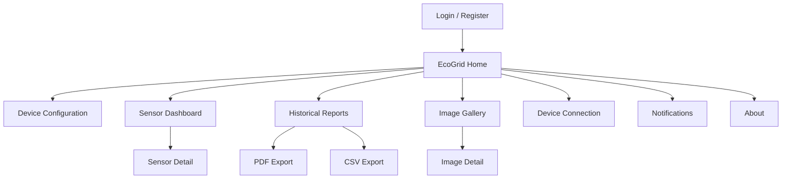
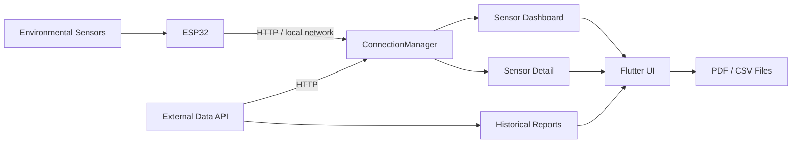

<div align="center">


# EcoGrid

### Environmental IoT monitoring from ESP32 to mobile insight

**EcoGrid is an open-source Flutter application for monitoring environmental sensor data, managing ESP32 connectivity, exploring measurement history, and exporting field data as PDF or CSV.**

[](https://flutter.dev/)
[](https://dart.dev/)
[](https://www.espressif.com/en/products/socs/esp32)
[](https://www.android.com/)
[](LICENSE)

</div>

---

## Overview

EcoGrid is a mobile interface for an environmental IoT sensing system built around **ESP32 devices and five monitored variables: temperature, humidity, pH, TDS, and UV**.

The application is designed to make sensor data useful beyond raw readings. It combines device configuration, live measurement retrieval, individual sensor views, historical exploration, connection-state management, and report generation in one Flutter application.

The repository contains the **mobile application**. ESP32 firmware and the external data backend are separate components and are not maintained here.

## At a glance

| | |
| --- | --- |
| **Platform** | Flutter mobile application |
| **Primary target** | Android |
| **IoT device** | ESP32 |
| **Monitored signals** | Temperature, humidity, pH, TDS, UV |
| **Transport** | HTTP polling over local network or external API |
| **Foreground refresh** | Approximately every 58 seconds |
| **Background refresh** | Approximately every 5 minutes |
| **Recovery** | Up to 5 retries with exponential backoff |
| **Historical export** | PDF and CSV |
| **Charts** | `fl_chart` |
| **Navigation** | GoRouter |
| **License** | MIT |

## Core capabilities

### Environmental sensor dashboard

EcoGrid provides a single dashboard for five environmental measurements:

| Signal | Role |
| --- | --- |
| **Temperature** | Environmental temperature monitoring |
| **Humidity** | Relative humidity monitoring |
| **pH** | Acidity and alkalinity measurements |
| **TDS** | Total dissolved solids monitoring |
| **UV** | Ultraviolet exposure monitoring |

Each signal can be opened in a dedicated detail view for deeper inspection.

### ESP32 and API connectivity

The application can retrieve measurements from either:

- a configured **ESP32 address** on the local network; or
- an **external HTTP API**, including the Google Apps Script endpoint used by the current reporting flow.

`ConnectionManager` centralizes connection state, polling, retries, status streams, and lifecycle-aware refresh behavior.

### Lifecycle-aware polling

EcoGrid does not poll at the same frequency indefinitely. The connection layer adapts its update interval according to the application lifecycle:

```text
Foreground    ~58 seconds
Background    ~5 minutes
Timeout       10 seconds per request
Retries       Up to 5 attempts
Recovery      Exponential backoff
Transport     HTTP polling
```

This keeps measurements reasonably fresh while reducing unnecessary background activity.

### Historical reporting

The report flow supports date-based historical queries and export to:

- formatted **PDF reports**;
- raw **CSV datasets**.

The generated files can be stored, opened, or shared through the platform-specific file utilities included in the project.

### Image records

EcoGrid also includes an image gallery and image-detail flow for visual records exposed through the application.

## Application flow



The Flutter router exposes dedicated flows for authentication screens, device configuration, sensor monitoring, image records, connection management, notifications, and project information.

## System architecture



The application separates UI, stateful screens, models, services, utilities, and reusable widgets. The connection service exposes data and connection-status streams rather than coupling network logic directly to every screen.

## Engineering highlights

### Centralized connection management

`ConnectionManager` is implemented as a shared service responsible for:

- choosing the active HTTP source;
- performing sensor requests;
- publishing connection-state changes;
- publishing incoming data through streams;
- manual refresh;
- reconnection;
- lifecycle-aware polling;
- exponential retry delays.

### Explicit connection states

The runtime models the connection lifecycle as:

```text
disconnected
connecting
connected
reconnecting
error
```

This makes the UI able to communicate connectivity instead of treating network failures as silent sensor failures.

### Separation of concerns

The project is organized around focused layers:

```text
Flutter UI
   |
Screens and reusable widgets
   |
Services and application lifecycle
   |
ConnectionManager
   |
HTTP API / ESP32
```

Reporting and file operations are handled independently through utility and platform-specific helpers.

## Technology stack

| Layer | Technology |
| --- | --- |
| **Framework** | Flutter |
| **Language** | Dart 3.9+ |
| **UI system** | Material 3 |
| **Navigation** | GoRouter |
| **HTTP networking** | `http`, Dio |
| **Local preferences** | SharedPreferences |
| **Charts** | `fl_chart` |
| **PDF generation** | `pdf`, `printing` |
| **CSV export** | `csv` |
| **File access** | `path_provider`, `open_file` |
| **Sharing** | `share_plus` |
| **Assets** | `flutter_svg`, `google_fonts` |
| **IoT hardware** | ESP32 |
| **Primary platform** | Android |

Current application version: **0.1.2+2**.

## Project structure

```text
Ecogrid_system/
├── android/              Android platform configuration
├── assets/               Application images and icons
├── lib/
│   ├── components/       Reusable UI and connection-status components
│   ├── constants/        Shared configuration and constants
│   ├── models/           Application data models
│   ├── screens/          Authentication, home, sensors, reports and gallery
│   ├── services/         Connectivity and lifecycle management
│   ├── styles/           Shared visual system
│   ├── utils/            PDF, file and platform utilities
│   └── widgets/          Reusable navigation and interface widgets
├── test/                  Widget and behavior tests
└── pubspec.yaml           Flutter dependencies and application metadata
```

## Testing

The repository includes Flutter tests covering areas such as:

- navigation rules;
- device configuration;
- report date ranges;
- sensor-dashboard navigation;
- UI styling contracts;
- time validation;
- PDF/file behavior;
- project information screens.

Run the test suite with:

```bash
flutter test
```

## Getting started

### Requirements

- Flutter SDK **3.35.7 or newer**
- Dart SDK compatible with **3.9.2+**
- Android SDK
- Android Studio or VS Code with Flutter tooling
- a compatible Java JDK for the Android Gradle toolchain

### Clone and install

```bash
git clone https://github.com/Kas01000101/Ecogrid_system.git
cd Ecogrid_system
flutter pub get
```

### Run locally

```bash
flutter run
```

For direct ESP32 monitoring, the mobile device must be able to reach the configured ESP32 endpoint over the local network.

### Build a release APK

```bash
flutter clean
flutter pub get
flutter build apk --release
```

Output:

```text
build/app/outputs/flutter-apk/app-release.apk
```

## Configuration notes

The current application can consume both an external API and direct ESP32 endpoints. Environment-specific addresses should be reviewed before distributing a build outside the original deployment environment.

Android signing credentials such as keystores and `key.properties` must remain outside version control.

The backend/API and ESP32 firmware are intentionally outside the scope of this repository.

## Open source

EcoGrid is open source under the **MIT License**. You may use, study, modify, distribute, and build on the software subject to the terms in [`LICENSE`](LICENSE).

See [`OPEN_SOURCE.md`](OPEN_SOURCE.md) for the repository-wide open-source policy and [`CONTRIBUTING.md`](CONTRIBUTING.md) before submitting changes.

Third-party packages and assets remain subject to their respective licenses and attribution requirements.

## Contributing

Contributions are welcome. Before opening a pull request:

```bash
flutter pub get
flutter analyze
flutter test
```

Do not commit private API credentials, device secrets, signing keys, personal data, or local environment files.

## Project status

EcoGrid is a **functional mobile IoT application** with implemented sensor monitoring, connection management, reporting, navigation, and test coverage. The mobile client is maintained independently from its external backend and ESP32 firmware.

---

<div align="center">

**EcoGrid · Monitor · Understand · Report**

</div>
