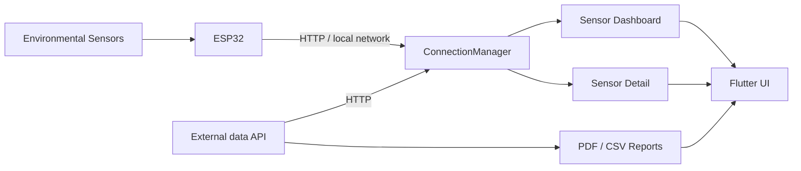

<div align="center">


# EcoGrid

**Environmental IoT monitoring, reporting, and ESP32 connectivity from one Flutter app.**

Monitor **temperature, humidity, pH, TDS, and UV** data. Connect to an ESP32. Review sensor activity and export historical information as **PDF or CSV**.

[](https://flutter.dev/)
[](https://dart.dev/)


[Overview](#what-is-ecogrid) · [Features](#features) · [Architecture](#architecture) · [Tech Stack](#tech-stack) · [Getting Started](#getting-started)

<br>


</div>

---

## What is EcoGrid?

EcoGrid is a **Flutter mobile application for environmental IoT monitoring**. It provides a single interface for connecting to an ESP32-based sensing system, viewing environmental measurements, exploring individual sensor details, and generating historical reports for offline analysis.

The app is built around five monitored variables — **temperature, humidity, pH, TDS, and UV** — with lifecycle-aware connectivity designed to keep sensor data available without continuously polling at the same rate in the background.

> This repository contains the **mobile application**. The external backend/API and ESP32 firmware are outside this repository.

## Features

- **Environmental sensor dashboard** — monitor temperature, humidity, pH, TDS, and UV measurements from one interface.
- **ESP32 connectivity** — configure the device IP and retrieve sensor data over the local network.
- **Automatic data refresh** — HTTP polling with connection states, manual refresh, retry handling, and exponential backoff.
- **Lifecycle-aware updates** — foreground and background polling intervals are managed separately to reduce unnecessary activity.
- **Sensor detail views** — inspect individual measurements and their visual history.
- **Historical reports** — select a date range and export available data as formatted **PDF** or raw **CSV**.
- **Image gallery** — browse and open image records exposed through the application flow.
- **Material 3 interface** — Android-first UI with EcoGrid's mint/green visual system and responsive Flutter components.

## Sensor Monitoring

| Signal | Purpose in EcoGrid |
| --- | --- |
| **Temperature** | Environmental temperature monitoring |
| **Humidity** | Relative humidity monitoring |
| **pH** | Acidity / alkalinity measurements |
| **TDS** | Total dissolved solids measurements |
| **UV** | Ultraviolet exposure monitoring |

## Architecture



The application separates UI, models, reusable components, services, and utilities. `ConnectionManager` centralizes sensor communication and exposes data/status streams to the interface.

### Connection model

```text
Foreground     HTTP polling ~58 s
Background     Reduced polling ~5 min
Retries        Up to 5 attempts
Recovery       Exponential backoff
Transport      HTTP polling
Sources        External API or ESP32 endpoint
```

WebSocket is represented in the connection model but currently falls back to HTTP polling.

## Tech Stack

| Layer | Technology |
| --- | --- |
| **Mobile UI** | Flutter · Dart · Material 3 |
| **Navigation** | GoRouter |
| **Networking** | `http` · Dio |
| **Local persistence** | SharedPreferences |
| **Charts** | fl_chart |
| **Reports** | `pdf` · `printing` · `csv` |
| **Files & sharing** | path_provider · open_file · share_plus |
| **Assets** | flutter_svg · google_fonts |
| **Primary target** | Android |

## Application Flow

```text
Login / Register
      │
      ▼
Device configuration
      │
      ▼
EcoGrid home
  ├── Sensor dashboard
  │     └── Sensor detail
  ├── Reports → PDF / CSV
  ├── Image gallery → Image detail
  ├── Device connection
  ├── Notifications
  └── About
```

## Getting Started

### Requirements

- Flutter SDK **3.35.7 or newer**
- Dart SDK **3.9.2 or newer**
- Android SDK — API 34+ recommended
- Android Studio or VS Code with Flutter tooling
- A compatible Java JDK for the Android Gradle toolchain

### Run locally

```bash
git clone https://github.com/Kas01000101/Ecogrid_system.git
cd Ecogrid_system
flutter pub get
flutter run
```

To use live ESP32 data, the mobile device and IoT device must be reachable on the appropriate local network and the ESP32 address must be configured in the app.

### Run tests

```bash
flutter test
```

The repository includes tests for navigation rules, device configuration, report date ranges, sensor-dashboard navigation, styles, time validation, and file/report behavior.

### Build Android APK

```bash
flutter clean
flutter pub get
flutter build apk --release
```

Generated APK:

```text
build/app/outputs/flutter-apk/app-release.apk
```

## Project Structure

```text
lib/
├── components/    reusable UI components and connection status
├── constants/     global configuration, colors and text constants
├── models/        application data models
├── screens/       login, home, sensors, reports, gallery and settings flows
├── services/      connection and application lifecycle management
├── styles/        shared visual system
├── utils/         PDF, file and platform utilities
└── widgets/       reusable navigation and UI widgets

test/              widget and behavior tests
android/           Android platform configuration
assets/            application images and icons
```

## Project Notes

- The **backend/API is not maintained in this repository**.
- ESP32 live monitoring depends on network reachability between the app and the device.
- Signing credentials such as `keystore` and `key.properties` are intentionally excluded from version control.
- The current package version is **0.1.2+2**.

## License

This project is provided for **private / academic use**. All rights reserved.
