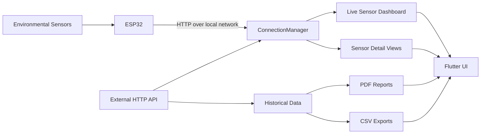
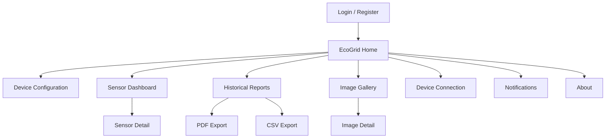

<div align="center">


# EcoGrid System

### From environmental sensors to clear mobile insight.

**EcoGrid System is an open-source Flutter IoT application that connects environmental sensing with mobile monitoring, historical analysis, and field-ready reporting.**

[](https://flutter.dev/)
[](https://dart.dev/)
[](https://www.espressif.com/en/products/socs/esp32)
[](https://www.android.com/)
[](OPEN_SOURCE.md)

</div>

---

## Overview

EcoGrid System is the mobile layer of an environmental IoT monitoring workflow built around **ESP32 devices** and five environmental variables: **temperature, humidity, pH, TDS, and UV**.

The application turns raw sensor readings into a usable monitoring experience. It combines device connectivity, live measurements, dedicated sensor views, historical data exploration, connection-state management, and PDF/CSV export in a single Flutter application.

The repository contains the **Flutter mobile client**. ESP32 firmware, hosted APIs, and external data infrastructure are separate components and are not maintained in this repository.

<p align="center">
  
</p>

## At a glance

| | |
| --- | --- |
| **Product** | Mobile environmental IoT monitoring application |
| **Primary platform** | Android |
| **IoT hardware** | ESP32 |
| **Monitored variables** | Temperature, humidity, pH, TDS, UV |
| **Connectivity** | HTTP polling from ESP32 or external API |
| **Live refresh** | Approximately every 58 seconds in foreground |
| **Background refresh** | Approximately every 5 minutes |
| **Historical reporting** | PDF and CSV export |
| **Charts** | `fl_chart` |
| **Navigation** | GoRouter |
| **Framework** | Flutter + Dart |
| **License** | MIT |

## What EcoGrid does

### Monitor five environmental variables

EcoGrid presents a unified dashboard for five sensing domains:

| Signal | Purpose |
| --- | --- |
| **Temperature** | Monitor environmental temperature |
| **Humidity** | Track relative humidity |
| **pH** | Observe acidity and alkalinity |
| **TDS** | Monitor total dissolved solids |
| **UV** | Track ultraviolet exposure |

Each sensor can be opened in a dedicated detail view for closer inspection.

### Connect to an ESP32 or external API

The connection layer can consume measurements from either:

- a configured **ESP32 address** reachable over the local network; or
- an **external HTTP API** that exposes the sensor data flow.

The application centralizes this behavior in `ConnectionManager`, rather than coupling network logic directly to every screen.

### Adapt polling to the application lifecycle

EcoGrid adjusts its polling behavior depending on whether the app is in the foreground or background.

```text
Foreground refresh   ~58 seconds
Background refresh   ~5 minutes
Request timeout      10 seconds
Retry attempts       Up to 5
Retry strategy       Exponential backoff
Transport            HTTP polling
```

The active implementation also exposes explicit connection states:

```text
disconnected
connecting
connected
reconnecting
error
```

This allows the UI to represent connectivity as a first-class application state instead of treating network failures as missing sensor data.

### Explore historical measurements

The reporting flow supports date-based historical queries so users can inspect measurements beyond the latest reading.

### Export field data

Historical information can be exported as:

- formatted **PDF reports**;
- raw **CSV datasets**.

Generated files can be saved, opened, or shared through the platform utilities used by the application.

### Manage visual records

EcoGrid also includes an image gallery and image-detail flow for visual records available through the application.

## Data flow



The result is a simple pipeline:

```text
Sense → Connect → Monitor → Review → Export
```

## Application flow



The router separates authentication, configuration, monitoring, reporting, gallery, connectivity, notifications, and project-information flows into dedicated screens.

## Engineering highlights

### Centralized connection management

`ConnectionManager` is implemented as a shared service responsible for:

- selecting the active data source;
- performing HTTP polling;
- publishing sensor data through streams;
- publishing connection-state changes;
- manual refresh and reconnection;
- lifecycle-aware polling;
- timeout handling;
- bounded retry attempts;
- exponential retry delays.

### Lifecycle-aware networking

The application reduces background network activity by switching from the normal foreground update interval to a longer background interval when appropriate.

### Clear separation of concerns

The repository is organized around focused layers:

```text
Flutter UI
   |
Screens and reusable widgets
   |
Services and lifecycle management
   |
ConnectionManager
   |
ESP32 / External HTTP API
```

Reporting and platform file operations are handled independently through utility classes and platform-aware helpers.

### Export-oriented workflow

The system does not stop at visualization. PDF and CSV generation make collected measurements portable for review, documentation, and downstream analysis.

## Technology stack

| Layer | Technology |
| --- | --- |
| **Framework** | Flutter |
| **Language** | Dart 3.9+ |
| **UI** | Material 3 |
| **Navigation** | GoRouter |
| **Networking** | `http`, Dio |
| **Local preferences** | SharedPreferences |
| **Charts** | `fl_chart` |
| **PDF generation** | `pdf`, `printing` |
| **CSV export** | `csv` |
| **File access** | `path_provider`, `open_file` |
| **Sharing** | `share_plus` |
| **Assets** | `flutter_svg`, `google_fonts` |
| **IoT hardware** | ESP32 |
| **Primary platform** | Android |

Current application version: **0.1.2+2**.

## Repository structure

```text
Ecogrid_system/
├── android/              Android platform configuration
├── assets/               Application images and icons
├── lib/
│   ├── components/       Reusable UI and connection-state components
│   ├── constants/        Shared configuration and constants
│   ├── models/           Data models
│   ├── screens/          Authentication, home, sensors, reports and gallery
│   ├── services/         Connectivity and lifecycle management
│   ├── styles/           Shared visual system
│   ├── utils/            Reporting, file and platform utilities
│   └── widgets/          Reusable navigation and UI widgets
├── test/                  Flutter widget and behavior tests
└── pubspec.yaml           Dependencies and application metadata
```

## Testing

The repository includes Flutter tests covering application behavior such as navigation, device configuration, reporting, sensor-dashboard routing, UI contracts, time validation, file behavior, and project-information screens.

Run the test suite with:

```bash
flutter test
```

Static analysis:

```bash
flutter analyze
```

## Getting started

### Requirements

- Flutter SDK **3.35.7 or newer**
- Dart SDK compatible with **3.9.2+**
- Android SDK
- Android Studio or VS Code with Flutter tooling
- compatible Java JDK for the Android Gradle toolchain

### Clone and install

```bash
git clone https://github.com/Kas01000101/Ecogrid_system.git
cd Ecogrid_system
flutter pub get
```

### Run locally

```bash
flutter run
```

For direct ESP32 monitoring, the mobile device must be able to reach the configured ESP32 endpoint over the local network.

### Build a release APK

```bash
flutter clean
flutter pub get
flutter build apk --release
```

Release output:

```text
build/app/outputs/flutter-apk/app-release.apk
```

## Configuration and security

EcoGrid can consume both external HTTP APIs and direct ESP32 endpoints. Environment-specific URLs and device addresses should be reviewed before distributing a build outside its original deployment environment.

Do not commit:

- API keys or private tokens;
- ESP32 credentials;
- Android signing keys or keystores;
- `key.properties` containing secrets;
- personal data or private datasets;
- production-only environment configuration.

The external backend and ESP32 firmware remain outside the scope of this repository.

## Open source

EcoGrid System is open-source software under the **MIT License**.

You may use, study, modify, distribute, sublicense, and build on the source code subject to the license terms. See [`LICENSE`](LICENSE) and [`OPEN_SOURCE.md`](OPEN_SOURCE.md).

Third-party packages and assets remain subject to their respective licenses and attribution requirements.

## Contributing

Contributions are welcome. Before opening a pull request, run:

```bash
flutter pub get
flutter analyze
flutter test
```

Then review [`CONTRIBUTING.md`](CONTRIBUTING.md) for repository guidelines.

## Project status

EcoGrid System is a **functional mobile IoT application** with implemented environmental monitoring, connection management, historical reporting, file export, navigation, and automated test coverage.

The mobile client is maintained independently from the external backend and ESP32 firmware so each layer of the wider IoT system can evolve separately.

---

<div align="center">

**EcoGrid System · Sense · Monitor · Understand · Report**

</div>
