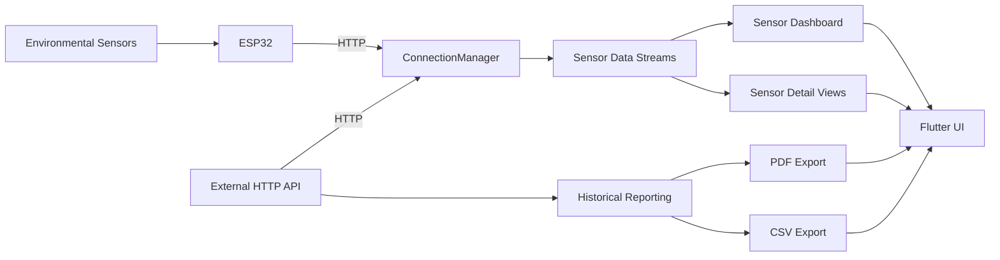

# EcoGrid Architecture

## Scope

EcoGrid is the Flutter mobile layer of a broader environmental IoT system. The mobile client receives environmental measurements from an ESP32 or an external HTTP API, presents live and historical information, and supports report generation and file sharing.

The ESP32 firmware and external backend are separate components and are not maintained in this repository.

## High-level architecture



## Application layers

```text
Flutter UI
   |
Screens and reusable widgets
   |
Services and lifecycle management
   |
ConnectionManager
   |
HTTP API / ESP32
```

### UI layer

The UI is implemented with Flutter and Material 3. Screens are responsible for presentation and user interaction, while reusable components and widgets keep shared UI behavior outside individual screens.

### Navigation layer

GoRouter defines the application routes for authentication, device configuration, home, sensor monitoring, image records, device connectivity, notifications, and project information.

See [`NAVIGATION.md`](NAVIGATION.md) for the current route map.

### Connectivity layer

`lib/services/connection_manager.dart` centralizes sensor connectivity. It manages the active endpoint, polling, retry attempts, connection-state streams, sensor-data streams, manual refresh, reconnection, and lifecycle-aware intervals.

### Lifecycle layer

The connection service works with `LifecycleManager` so foreground and background operation can use different refresh intervals. This reduces unnecessary background polling while maintaining fresher data during active use.

### Reporting layer

Historical data and reporting are handled independently from live sensor polling. The application supports PDF and CSV output using dedicated Flutter packages and file utilities.

## Primary repository areas

```text
lib/
├── components/     Reusable UI and status components
├── constants/      Shared configuration and constants
├── models/         Data models
├── screens/        Application screens
├── services/       Connectivity and lifecycle services
├── styles/         Shared visual styling
├── utils/          Reporting and file utilities
└── widgets/        Reusable navigation and UI widgets
```

## Design principles

The current implementation follows several practical principles:

- keep network behavior centralized instead of duplicating it across screens;
- expose connectivity through explicit states and streams;
- separate live monitoring from historical reporting;
- keep environment-specific addresses configurable;
- avoid committing credentials, signing keys, or private infrastructure configuration;
- keep the mobile client independent from the ESP32 firmware and external backend.
